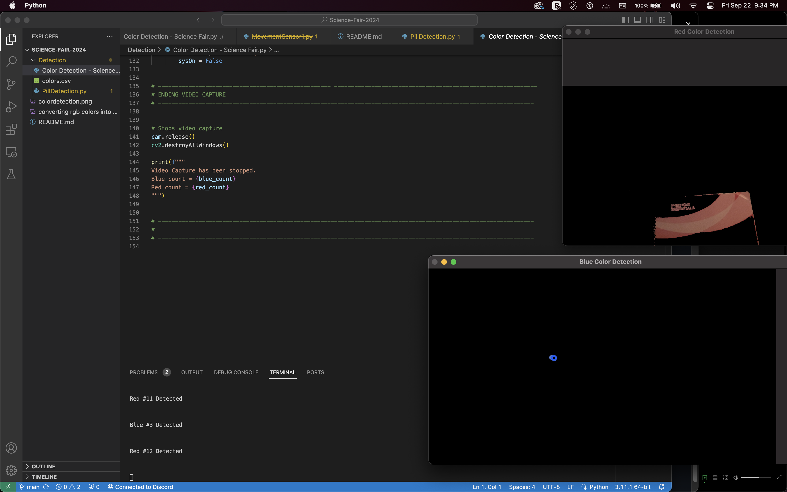

# Science Fair 2024
All code and files for the program accompanied with the project

<!-- ## Color Detection

- Detects red and blue colors 
- Provides a count and alert when detected
 -->

## Convert RGB values to HSV
    > import numpy as np
    > import cv2
    > blue = np.uint8([[[255,0,0 ]]])
    > hsv_blue = cv2.cvtColor(blue,cv2.COLOR_BGR2HSV)
    > print(hsv_blue)
        [[[120 255 255]]]
